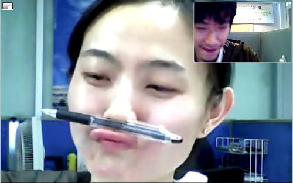

<section class="slide" id="title">
#这是一个小说家

</section>

<section class="slide" id="chapter1-1">
##第一章  一份体面的工作
丑，不要全怪到父母身上，二十岁的女丑女孩多半是咎由自取。古话说的好，没有丑女人，只有懒女人。二十多岁的女孩，皮肤黄黄的是怎么回事呢？自己想想，清洁防晒抗氧化，做到了没有？保养，是最重要的，年轻人要舍得在自己身上投资，认由年华老去真是赤裸裸的浪费，是最愚蠢的行为。当然咯，有的姑娘先天条件好，那自然是含着金汤匙的幸运儿，那些先天条件差的，就要付出比别人更多的努力！‘少吃饭多喝水，少熬夜多敷脸’这十二字金科玉律是那些女明星也要恪守的，平常人更要严格要求自己！”

“笑，是第二重要的，古龙不是说过吗？会笑的女孩运气不会太差。在大世界里，客人就是上帝。上帝高兴了，你也要跟着高兴，要是上帝生气了，你就要赔着笑，让上帝消气。姑娘们，别觉得是大世界委屈各位，‘大世界’外面那个更大的世界里也一样，有钱人就是上帝，你要是不赔笑脸给金主，哪里有饭吃，哪里有衣穿？这可是大实话！可能有人说，世界变了，人人平等。这话也对。你们挣了钱出去找个地方洗脚修指甲，人家也拿你当上帝。这就是所说的平等。能在大世界工作，姑娘们是应该偷笑的，咱们王经理的目标是要建一个专业的洗浴中心，在我看来，这是一个非常了不起的计划，你们就是这项计划的中坚力量。做专业的服务人员，保持微笑，大家能不能做到？”

“能！”

这是大世界洗浴中心的女服务员特别培训周中的一天早上，服务员的一天就这样开始了。方庆庆是她们中的一员，但是她不是洗脚的，也不是搓澡的，她是洗洗脚盆的。她之所以没有洗脚，不是因为她不会洗，全因为她是一个丑女，一个笑起来更难看的丑女。

她身高不足一米五，平平的脸上嵌着一双细小的眼睛，塌鼻梁下面挂着两片暗淡的香肠嘴，而且她须发有点繁盛，嘴唇上面生着一层小胡须。“一个人怎么可以生得这么丑！”她不止一次听到身后有人这样说了，中学老师，同学，公交车上的陌生人，大世界的洗脚妹……可是真的像培训的老师说的那样，她是“咎由自取”吗？“少吃饭多喝水”，这条她肯定做到了，她哪里舍得大把花钱吃饭呢，如果喝水能饱，她肯定天天喝水了，大世界换了经理后，就有免费的水喝了。“少熬夜多敷脸”，她也不怎么熬夜，晚上九点就睡了，有时还更早，宿舍里的洗脚妹没有人愿意和她说话，况且早上不到6点，她就要起床干活了，敷脸，她也是试过的，大世界外面就是屈臣氏，上个月发工资，她去买了一盒燕窝精华面膜，四十大块，敷了两天，脸上火辣辣的疼，还起了一层小疙瘩，赶紧停了，过了一个礼拜才消退。丑得无可救药就是这样吗？丑到甚至不能洗脚？
</section>

<section class="slide" id="chapter1-2">
##第一章  一份体面的工作

洗洗脚盆的工作只有她一个人做，洗得再干净也没有奖金，要是没洗干净出了篓子，轻则罚钱，重则滚蛋。庆庆觉得培训老师说的有一句话是对的，她确实比较珍惜在大世界的工作。比起餐馆里洗盘子的，这儿的工作算不错了，她也洗过盘子，一整天坐在一个板凳上，面前两盆水，一摞又一摞叠的老高的布满油污的大碟小盘被端来，饭点的时候，那些碗垒起的大厦可以直接把她遮住，那漫天飞地的油让人莫名地绝望。洗脚盆干净多了，没什么油，而且洗脚妹放进去各种香波精油，洗盆的时候，被香气包围，有一种幸福的感觉。

庆庆很羡慕洗脚妹，在她看来那是一个体面的工作，只有好看的人才能做的工作自然是体面的工作，而且还有提成拿，客人来大世界，可以点名要哪个洗脚妹服务，被点了名的洗脚妹月底就有奖励。

庆庆会洗脚的，而且洗得好，这不是她自己说的，是灵子说的。灵子是大世界女工宿舍唯一一个和她有些交情的，是四川老乡，干保洁的，最近辞职回老家结婚去了。灵子在的时候，庆庆晚上会给灵子洗脚，两个人一起聊天，聊那些说了八百遍的往事，庆庆最爱说自己小时候参加六一节目跳舞的事，那时候她并不丑，跳舞的怎么会丑。老师用彩带给她和班上的漂亮女孩缠起两个又弯又翘的牛角辫，那是从那年春节晚会上的儿童舞蹈上学来的。庆庆说，本来老师要求都买红色的彩带的，大家都去买，那个唯一卖彩带的商店里的红彩带就给扯光了，于是她只好买了黄色的彩带来，那个舞蹈节目就属她最醒目了，因为她是不同的那一个。庆庆说她小时候很会念书，作文写得尤其好，有一次语文老师出的题目是记难忘的一件事，她写的是和全班同学一起在操场上除草的故事，全班分成六个小组比赛，她们组的组员们一个个“争先恐后”，锄草的锄草，拔草的拔草，终于争得第一，每个组员都“大汗淋漓”，“兴高采烈”，她记得清楚她用了哪些成语，因为老师特别为此表扬了她，用红笔在成语下面画了圈圈，然后在作文纸的右上角写了个大大的“优”，她的作文还被贴在板报上展示一周。灵子每次都会听得很认真，就像没听过一样，她会问“操场上怎么有草啊？”“操场上真的有草吗？”等等问题，庆庆说：“有啦，我们那个是土的操场，每年都要长草的。”

洗脚是有学问的。庆庆的床头放了三本足疗的书《足疗入门必读手册》，《足疗技术完全图解》和《足底疗法治百病》。书上说，人有脚，好比树有根，“树枯根先竭，人老脚先衰”。人的五脏六腑在足底都有相应的投影，分别对着心、肺、肝、脾和肾，足部还是足三阴经的起始点，足三阳经的终止点，踝关节以下聚集了六十多个穴位，常按摩刺激脚底穴位，可以调理脏腑，疏通经络，强身健体，祛病出邪。庆庆本来是要来应聘洗脚妹的，来之前她买了三本书，认真的学习，在自己的脚上试手法。应聘的时候，却没有给她展示的机会，招聘的是个秃头男人。劈头就问：

“会洗脚吗？”

庆庆说：“会。”
</section>

<section class="slide" id="gaga">
#我是嘎嘎
</section>

